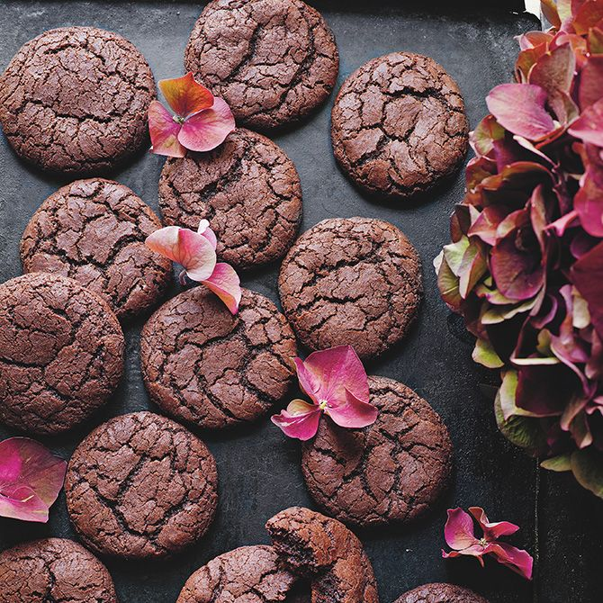

# Kladdkakekakor med nutella

[Source](https://www.godare.se/recept/a/Ea8okG/kladdkakekakor-med-nutella)

## Ingredients
- 50 g smör
- 100 g mörk choklad, ca 70 procent
- 2 dl strösocker
- 2 ägg
- 1,5 dl hasselnötskräm, t ex nutella
- 3,5 dl vetemjöl
- 0,5 dl kakao
- 1 tsk bakpulver
- 2 tsk vaniljsocker
- 2 krm salt

## Guide
- Sätt ugnen på 175 grader, över- och undervärme.
- Smält smöret i en kastrull. Hacka chokladen och smält den försiktigt i smöret.
- Rör samman socker och ägg i en bunke. Blanda ner chokladblandningen och hasselnötskrämen.
- Blanda mjöl, kakao, bakpulver, vaniljsocker och salt. Rör ner blandningen i bunken och rör ihop till en tjock smet. Känns den lite för lös är det bara att låta den stå i några minuter för att den ska bli mer fast.
- Forma smeten till bollar och lägg dem glest på en plåt med bakplåtspapper. Grädda mitt i ugnen i cirka 10 minuter. Kanterna ska vara lite hårda, men i mitten ska kakorna vara mjuka.

