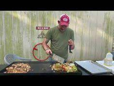

# Jambalaya

[Source](https://www.youtube.com/watch?v=4AjJpNaebzQ&ab_channel=Ralphthebaker)

## Ingridienser
- lök
- paprika röd/grön
- Vochestershiere sås
- Kycklinglår
- korv
- Gårdagens ris
- Cajunkryddor
- seleri
- vitlökspulver

## Guide
- lök, paprika, seleri på medium
- kyckling
- krydda allt
- krydda lök och vitlökpulver, persilja, salt pepper (kyckling rå) 
- allt med wochestershiersås
- laga färdigt kyckling på hör och grönsaker på medium
- lägg till 75g smör på grönsakerna när dom är halvvägs
- lägg på korv och krydda + smör
- släng på ris
- blanda ihop allt
- krydda + lök och vitlök

