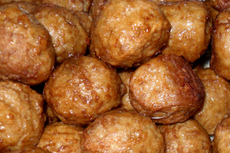

# Swedish Meatballs

## Ingredients
- 4 1/2 dl milk
- 15 tbsp (90 grams) breadcrumbs
- 1500 g beef or mixed ground meat
- 1 1/2 yellow onion (150 grams) 
- 3 eggs 
- 3 tsp salt (18 grams)
- 3 pinches pepper (1 grams)
- 1 1/2 tsp sugar (7.5 grams)

## Guide
1. Preheat your oven to 200°C (390°F) and line a baking sheet with parchment paper.
2. Mix milk and breadcrumbs in a large bowl and let it swell for about 10 minutes.
3. Add beef or mixed ground meat to the bowl and mix well.
4. Stir in the grated onion, eggs, salt, pepper, and sugar into the meat mixture until everything is evenly distributed.
5. Shape small meatballs from the mixture and place them evenly spaced on the prepared baking sheet.
6. Bake the meatballs in the preheated oven for about 20-25 minutes, or until they are cooked through and have a golden brown color.
7. Once cooked, remove the meatballs from the oven and let them cool slightly before serving.
8. Serve the baked meatballs hot with your favorite accompaniments and enjoy!